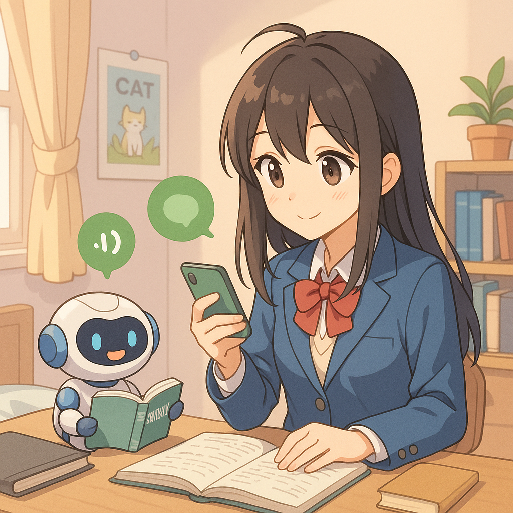

<div align="center">

  
  # AI English Study Partner
  
  [**English**](./README.md) | [**繁體中文**](./README.zh-TW.md)
  
  A multimodal AI-powered English learning chatbot built on the LINE platform, designed to help users engage in contextual English conversation with seamless interaction via text, speech, and image.  

</div>

# Table of contents
- [Key Features](#key-features)
- [How To Use](#how-to-use)

- [Project Structure](#project-structure)
- [License](#license)

# Key Features
- ✅ **Multimodal Chatbot**: Combines text, voice, and image input/output to create immersive learning scenarios.
- 🧠 **Integrated Deep Learning Models**:
  - **LLM (Large Language Model)**: Handles conversation generation.
  - **STT (Speech-to-Text)**: Converts user speech into text.
  - **TTS (Text-to-Speech)**: Reads AI responses aloud.
  - **VLM (Vision-Language Model)**: Processes image-based questions or inputs.
- 📚 **RAG (Retrieval-Augmented Generation)**: Enhances accuracy and informativeness of generated responses using vector database.
- 🔄 **Scheduled Push Notifications**: Keeps learners engaged and builds daily habits.
- 💬 **LINE Bot Interface**: No need to download apps—just chat on LINE.
- ⚙️ **One-click Environment Setup**: Run `install.py` to install all required dependencies.

# How To Use  
### 🌐 1. Set up ngrok (Expose your local server to the internet)  
LINE Bot webhook requires a public HTTPS URL. Ngrok helps you create a secure tunnel from your local machine:

Note the HTTPS URL generated you will use this as your webhook URL.

### 🔔 2. Register and configure your LINE Bot
Go to the LINE Developers Console, create a Provider and then a Messaging API Channel.

Find and copy your LINE_CHANNEL_ACCESS_TOKEN and LINE_CHANNEL_SECRET.

Enable Use webhook.

Set your webhook URL to your ngrok HTTPS URL.

Add your LINE Bot as a friend via the QR code in the LINE Developers Console.

### 🐍 3. Prepare Python environment and install dependencies
> **Python version**: 3.12  (Recommanded)
> 
> **Initial setup time**: ~10 minutes (via `install.py`)

```bash
git clone https://github.com/your-username/AIEnglishStudyPartner.git
cd AIEnglishStudyPartner

python -m venv venv
# Activate virtual environment:
# On macOS/Linux:
source venv/bin/activate
# On Windows:
venv\Scripts\activate

python install.py
```
The install script will:

- Install base dependencies

- Install CUDA-enabled PyTorch

- Install MeloTTS from GitHub

- Download UniDic Japanese dictionary

### 🔑 4. Configure your environment variables
Copy .env.example and fill in your tokens:
```
cp .env.example .env
```
Make sure the following variables are set correctly in .env:

- NGROK_TOKEN

- LINE_CHANNEL_ACCESS_TOKEN

- LINE_CHANNEL_SECRET

- HF_TOKEN
  
# Project Structure
```
AIEnglishStudyPartner/
├── install.py               # One-click install script
├── .env.example             # Environment variable template
├── main.py                  # Entry point (LINE bot server)
├── requirements.txt         # Python dependencies
├── models/                  # LLM, STT, TTS, VLM integration
│   ├── llm.py
│   ├── stt.py
│   ├── tts.py
│   ├── vlm.py
│   ├── rag.py
│   ├── relationalDB.py
│   ├── schemas.py
│   └── __init__.py
├── db
│   ├── vector_db/           # Vector store for RAG
│   ├── relational_db.db
├── static/                  # Static files (images, audio)
└── templates/               # HTML templates 
```

# License
[(Back to top)](#table-of-contents)

Apache-2.0 license

