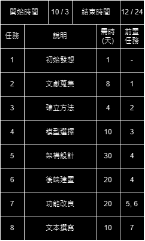
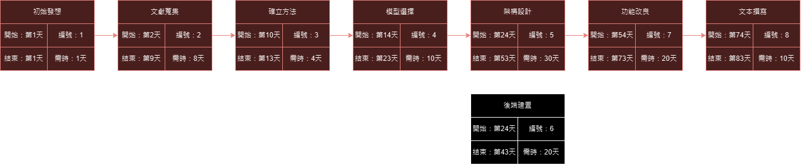
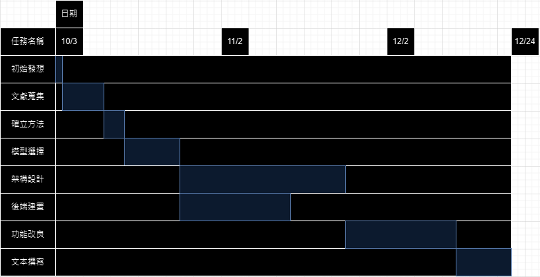

### 工作分解結構 Work Breakdown Structure (WBS)


### 計畫評核術圖 Program Evaluation and Review Technique Chart (PERT Chart)
```
紅色部分為關鍵路徑 
The red highlight is for Critical Path.
```


### 甘特圖 Gantt Chart

